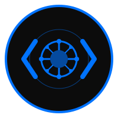

<p align="center">
  
</p>

<p align="center">
  
</p>

<p align="center">
  <strong>Your AI-powered Junior Developer</strong>
</p>

<p align="center">
  <a href="https://pypi.org/project/knocodex/"></a>
  <a href="https://github.com/avijeett007/knocodex/blob/main/LICENSE"></a>
  <a href="https://github.com/avijeett007/knocodex/stargazers"></a>
  <a href="https://github.com/avijeett007/knocodex/network/members"></a>
  <a href="https://github.com/avijeett007/knocodex/issues"></a>
</p>

<p align="center">
  <a href="https://knocodex.dev">Website</a> •
  <a href="https://docs.knocodex.dev">Documentation</a> •
  <a href="https://youtube.com/@kno2gether">YouTube</a> •
  <a href="https://kno2gether.com">Kno2gether</a> •
  <a href="https://github.com/avijeett007/knocodex/issues">Issues</a>
</p>

---

## 🚀 Overview

Knocodex is an open-source Python library that provides autonomous coding capabilities using AI agents. It transforms your development workflow by acting as a junior developer that can understand, implement, and improve code based on natural language instructions.

Developed by the team at [Kno2gether](https://kno2gether.com), Knocodex currently supports Claude Code with Aider support coming soon.

## ✨ Features

- **🔌 Easy Setup**: Simple installation and configuration process
- **🤖 Multiple Agent Support**: Use Claude Code now, with Aider support coming soon
- **🔄 GitHub Integration**: Automatically process issues with specific labels
- **⚙️ Autonomous Workflow**: AI agents analyze issues, implement solutions, and create PRs
- **📚 Project Documentation**: Automatically generate and update project documentation
- **📊 Dashboard**: Monitor task status and progress
- **🔧 Customizable**: Adapt to your specific development workflow

## 📋 Requirements

- Python 3.6+
- Redis (for task queue)
- GitHub account (for GitHub integration)
- Claude API access (for Claude agent)

## 🔧 Installation

```bash
# Install from PyPI
pip install knocodex

# Or install from source
git clone https://github.com/avijeett007/knocodex.git
cd knocodex
pip install -e .
```

## 🏁 Quick Start

```bash
# Set up knocodex globally
knocodex setup

# Initialize a project
cd your-project
knocodex init

# Start the autonomous agent
knocodex start
```

## 📖 Usage

### Global Setup

```bash
knocodex setup
```

This will:
- Check and install required dependencies
- Set up GitHub authentication
- Configure Claude MCP servers
- Create a global configuration file

### Project Initialization

```bash
knocodex init
```

This will:
- Create project-specific configuration
- Set up custom Claude commands
- Import MCP servers from Claude Desktop

### Starting the Agent

```bash
knocodex start
```

This will:
- Start the Redis server and worker
- Start monitoring GitHub issues with the "knocodex" label
- Process issues autonomously

### Other Commands

```bash
knocodex stop        # Stop the agent
knocodex status      # Check agent status
knocodex docs        # Generate project documentation
knocodex dashboard   # Start the RQ dashboard
```

## ⚙️ Configuration

Knocodex uses two levels of configuration:

1. **Global Configuration**: Stored in `~/.knocodex/config.json`
2. **Project Configuration**: Stored in `.knocodex/config.json` in your project directory

You can edit these files to customize the behavior of Knocodex.

## 🔍 How It Works

1. **Issue Analysis**: Knocodex monitors GitHub issues with specific labels
2. **Task Planning**: The AI agent analyzes the issue and creates a plan
3. **Implementation**: Code changes are implemented according to the plan
4. **Testing**: Changes are tested to ensure they work as expected
5. **Pull Request**: A PR is created with the changes and a detailed description

## 🤝 Contributing

Contributions are welcome! Please feel free to submit a Pull Request.

1. Fork the repository
2. Create your feature branch (`git checkout -b feature/amazing-feature`)
3. Commit your changes (`git commit -m 'Add some amazing feature'`)
4. Push to the branch (`git push origin feature/amazing-feature`)
5. Open a Pull Request

See the [CONTRIBUTING.md](CONTRIBUTING.md) file for detailed guidelines.

## 📜 License

This project is licensed under the MIT License - see the [LICENSE](LICENSE) file for details.

## 🔗 Links

- **Website**: [knocodex.dev](https://knocodex.dev)
- **Documentation**: [docs.knocodex.dev](https://docs.knocodex.dev)
- **YouTube Channel**: [youtube.com/@kno2gether](https://youtube.com/@kno2gether)
- **Kno2gether**: [kno2gether.com](https://kno2gether.com)
- **GitHub**: [github.com/avijeett007/knocodex](https://github.com/avijeett007/knocodex)

## 💼 Professional Services

Need help implementing Knocodex in your organization? Want to customize it for your specific needs?

Check out [Knocodex+ Professional Services](https://knocodex.dev/services) for enterprise support, custom development, and training.

---

<p align="center">
  <sub>Built with ❤️ by the <a href="https://kno2gether.com">Kno2gether</a> team</sub>
</p>
