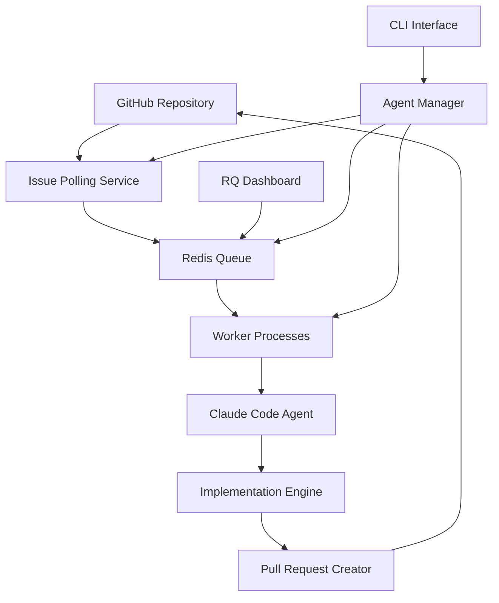
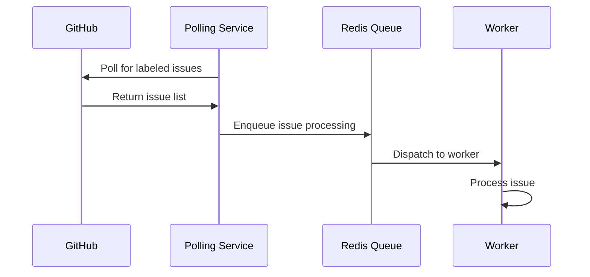
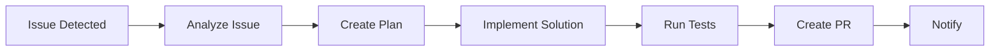
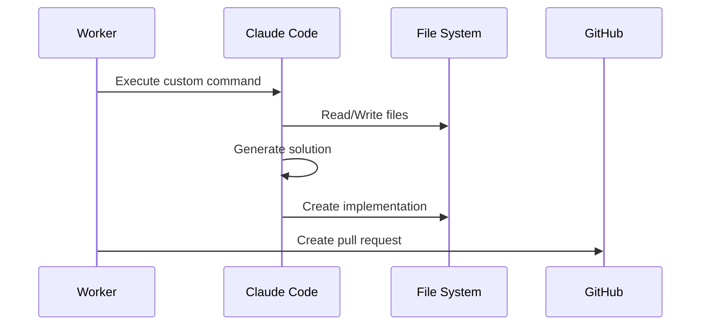
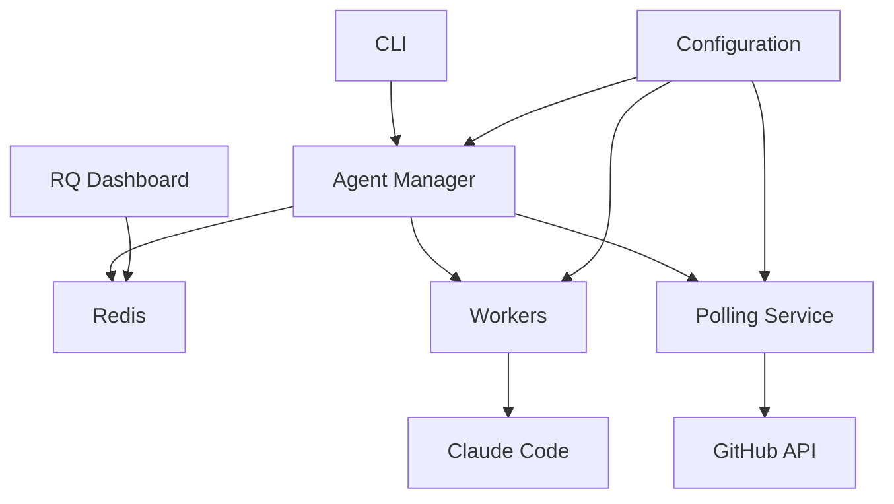
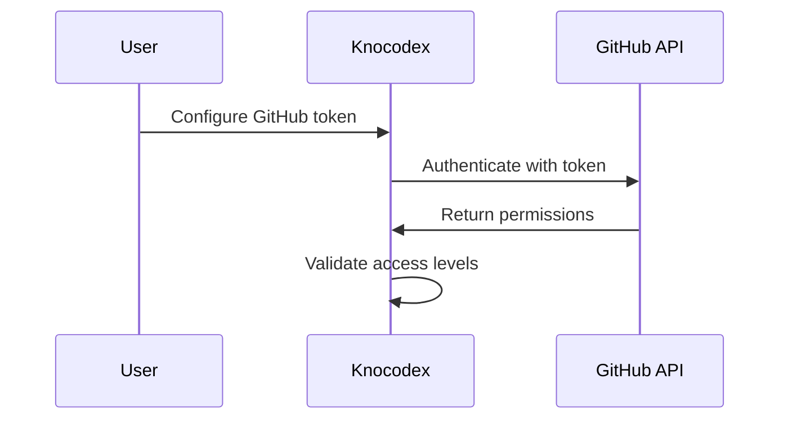

# Architecture

This document provides a comprehensive overview of Knocodex's architecture, design principles, and system components.

## System Overview

Knocodex is an autonomous AI-powered coding platform that uses a distributed, event-driven architecture to process GitHub issues and automatically generate solutions.



## Core Components

### 1. CLI Interface (`cli.py`)

The main entry point for user interactions:

```python
@click.group()
def cli():
    """Knocodex - Autonomous AI-Powered Code Development Platform"""
    
# Key commands:
# - knocodex init: Initialize project
# - knocodex start: Start all services  
# - knocodex stop: Stop all services
# - knocodex status: Check service status
# - knocodex dashboard: Open monitoring dashboard
```

**Key Features:**
- Click-based command interface
- Service orchestration
- Configuration management
- Status monitoring

### 2. Agent Manager (`agent_manager.py`)

Central orchestration component that manages all system services:

```python
class AgentManager:
    def __init__(self, config_path=None):
        self.config = Config.load(config_path)
        self.redis_client = None
        self.processes = {}
    
    def start_services(self):
        """Start all required services"""
        self._start_redis()
        self._start_workers()
        self._start_polling()
    
    def stop_services(self):
        """Stop all running services"""
        self._stop_processes()
```

**Responsibilities:**
- Service lifecycle management
- Process monitoring
- Configuration loading
- MCP server integration
- Redis connection management

### 3. Configuration System (`config.py`)

Hierarchical configuration management:

```python
class Config:
    def __init__(self):
        self.github = GitHubConfig()
        self.redis = RedisConfig()
        self.claude = ClaudeConfig()
        self.queue = QueueConfig()
        self.logging = LoggingConfig()
    
    @classmethod
    def load(cls, config_path=None):
        """Load configuration from file and environment"""
```

**Features:**
- YAML-based configuration
- Environment variable overrides
- Global and project-specific settings
- Configuration validation
- Default value fallbacks

### 4. Main Loop (`templates/main_loop.py`)

The polling service that monitors GitHub for new issues:

```python
def main_loop():
    """Main polling loop for GitHub issues and PRs"""
    redis_conn = get_redis_connection()
    queue = Queue('knocodex', connection=redis_conn)
    
    while True:
        # Poll for new issues
        issues = get_labeled_issues()
        
        # Enqueue processing tasks
        for issue in issues:
            if should_process_issue(issue):
                queue.enqueue(process_issue, issue.number)
        
        time.sleep(config.poll_interval)
```

**Functionality:**
- Continuous GitHub polling
- Issue filtering and prioritization
- Task enqueueing
- Error handling and recovery

### 5. Worker Process (`templates/worker.py`)

Background workers that execute Claude Code commands:

```python
def process_issue(issue_number):
    """Process a GitHub issue using Claude Code"""
    try:
        # Analyze issue
        analysis = run_claude_command('analyze-github-issue', issue_number)
        
        # Implement solution
        implementation = run_claude_command('implement-github-issue', issue_number)
        
        # Create pull request
        return create_pull_request(implementation)
    
    except Exception as e:
        logger.error(f"Failed to process issue {issue_number}: {e}")
        raise
```

**Capabilities:**
- Headless Claude Code execution
- Custom command processing
- Error handling and retry logic
- Result tracking and logging

## Data Flow

### 1. Issue Detection Flow



### 2. Processing Pipeline



### 3. Command Execution



## Design Principles

### 1. Event-Driven Architecture

- **Asynchronous Processing**: Non-blocking operations using Redis queues
- **Decoupled Components**: Services communicate through well-defined interfaces
- **Scalable Workers**: Multiple workers can process tasks concurrently

### 2. Reliability and Resilience

- **Retry Logic**: Failed tasks are automatically retried with exponential backoff
- **Health Monitoring**: Continuous health checks and service monitoring
- **Graceful Degradation**: System continues operating even if some components fail

### 3. Extensibility

- **Plugin Architecture**: Custom commands and processors can be added
- **Configuration-Driven**: Behavior can be modified without code changes
- **Template System**: Reusable templates for different types of work

### 4. Security

- **Token Management**: Secure handling of GitHub and API tokens
- **Sandboxed Execution**: Claude Code runs in isolated environments
- **Access Control**: Configurable permissions and access restrictions

## Component Interactions

### Service Dependencies



### Process Communication

1. **CLI ↔ Agent Manager**: Direct function calls
2. **Agent Manager ↔ Services**: Process management via subprocess
3. **Services ↔ Redis**: Queue operations and pub/sub
4. **Workers ↔ Claude Code**: Command execution via subprocess
5. **Components ↔ GitHub**: REST API calls

## Scalability Considerations

### Horizontal Scaling

- **Multiple Workers**: Scale processing capacity by adding more worker processes
- **Distributed Redis**: Use Redis Cluster for high availability
- **Load Balancing**: Distribute polling across multiple instances

### Performance Optimization

- **Connection Pooling**: Reuse connections to Redis and GitHub API
- **Caching**: Cache frequently accessed data (issue metadata, configuration)
- **Batch Processing**: Process multiple issues in batches when possible

### Resource Management

- **Memory Limits**: Configure memory limits for worker processes
- **CPU Throttling**: Limit CPU usage during intensive operations
- **Disk Space**: Monitor and clean up temporary files and logs

## Security Architecture

### Authentication Flow



### Security Boundaries

1. **Configuration Security**: Sensitive data encrypted at rest
2. **Network Security**: HTTPS for all external communications
3. **Process Isolation**: Workers run in separate processes
4. **File Permissions**: Restricted access to configuration and logs

## Monitoring and Observability

### Metrics Collection

- **Processing Metrics**: Success rates, processing times, queue lengths
- **System Metrics**: CPU usage, memory consumption, disk I/O
- **Business Metrics**: Issues processed, PRs created, user satisfaction

### Logging Strategy

```python
# Structured logging with multiple levels
logger = logging.getLogger('knocodex')

# Key log events:
# - Service startup/shutdown
# - Issue processing start/completion
# - Errors and exceptions
# - Performance metrics
```

### Health Checks

1. **Service Health**: Check if all services are running
2. **External Dependencies**: Verify Redis, GitHub API connectivity
3. **Resource Health**: Monitor system resources
4. **Queue Health**: Check queue sizes and processing rates

## Testing Strategy

### Unit Testing

- **Component Isolation**: Mock external dependencies
- **Configuration Testing**: Validate configuration loading and validation
- **Logic Testing**: Test core business logic and algorithms

### Integration Testing

- **Service Integration**: Test interactions between components
- **API Integration**: Test GitHub API interactions
- **Queue Integration**: Test Redis queue operations

### End-to-End Testing

- **Full Workflow**: Test complete issue processing pipeline
- **Error Scenarios**: Test failure handling and recovery
- **Performance Testing**: Load testing with multiple concurrent jobs

## Deployment Architecture

### Development Environment

```yaml
services:
  knocodex:
    build: .
    ports:
      - "5000:5000"
    environment:
      - REDIS_URL=redis://redis:6379
      - GITHUB_TOKEN=${GITHUB_TOKEN}
    depends_on:
      - redis
  
  redis:
    image: redis:alpine
    ports:
      - "6379:6379"
```

### Production Deployment

- **Container Orchestration**: Kubernetes or Docker Swarm
- **Service Discovery**: Automatic service registration and discovery  
- **Load Balancing**: Distribute requests across multiple instances
- **Persistent Storage**: Separate storage for logs and configuration

## Future Architecture Considerations

### Planned Enhancements

1. **Multi-Repository Support**: Process issues from multiple repositories
2. **Advanced Scheduling**: Cron-like scheduling for batch operations
3. **Plugin Ecosystem**: Third-party plugin support
4. **API Gateway**: RESTful API for external integrations
5. **Event Streaming**: Apache Kafka for high-throughput event processing

### Migration Strategy

- **Backward Compatibility**: Maintain compatibility during upgrades
- **Blue/Green Deployment**: Zero-downtime deployments
- **Database Migrations**: Automated schema migrations
- **Configuration Evolution**: Smooth configuration updates