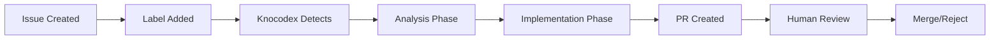

# Usage

This guide covers the day-to-day usage of Knocodex, including common workflows, CLI commands, and best practices.

## CLI Commands

### Service Management

```bash
# Initialize a new project
knocodex init

# Start all services
knocodex start

# Stop all services
knocodex stop

# Check service status
knocodex status

# Restart services
knocodex restart
```

### PR Review Management

Knocodex includes a PR review deduplication system that prevents the same PR from being reviewed multiple times. Here's how to use and configure it:

```bash
# Configure PR review mode (in .knocodex/config.json)
{
  "pr_review_mode": "never_repeat"  # Options: never_repeat, on_updates, manual_only
}

# Force a review for a specific PR (bypassing the deduplication system)
knocodex review --force pr 123

# Clear review history (will cause all PRs to be reviewed again)
knocodex clear-review-history
```

#### Review Modes

- **never_repeat**: Review each PR only once (default)
- **on_updates**: Re-review PRs when new commits are pushed
- **manual_only**: Disable automatic PR reviews entirely

### Monitoring and Dashboards

```bash
# Open RQ dashboard for queue monitoring
knocodex dashboard

# Generate project documentation
knocodex docs

# View service logs
knocodex logs

# View logs with tail
knocodex logs --tail 100
```

### Configuration Management

```bash
# Validate configuration
knocodex config validate

# Show current configuration
knocodex config show

# Test GitHub connection
knocodex test github

# Test Redis connection
knocodex test redis

# Run health checks
knocodex health
```

## Basic Workflow

### 1. Setting Up Automation

1. **Label Issues**: Add the configured label (e.g., `knocodex-auto`) to GitHub issues you want automated
2. **Start Service**: Ensure Knocodex is running with `knocodex start`
3. **Monitor Progress**: Use `knocodex dashboard` to watch task processing

### 2. Issue Processing Flow



### 3. Working with Results

- **Review Pull Requests**: Check generated PRs for quality and correctness
- **Provide Feedback**: Comment on PRs to improve future implementations
- **Monitor Logs**: Check logs for any issues or errors

## Advanced Usage

### Custom Commands

Create custom Claude commands for specialized tasks:

```bash
# Create a new command template
mkdir -p .claude/commands
cat > .claude/commands/my-custom-command.md << 'EOF'
# Custom Command

This command performs a specific task for your project.

## Instructions

1. Analyze the request
2. Implement the solution
3. Create documentation
4. Run tests
EOF
```

### Batch Processing

Process multiple issues at once:

```bash
# Set higher concurrency
knocodex config set queue.max_workers 8

# Process all labeled issues
knocodex process --all-labeled

# Process specific issues
knocodex process --issues 123,456,789
```

### Integration with CI/CD

Add Knocodex to your CI/CD pipeline:

```yaml
# .github/workflows/knocodex.yml
name: Knocodex Auto-Processing
on:
  issues:
    types: [labeled]
  
jobs:
  process-issue:
    if: contains(github.event.label.name, 'knocodex-auto')
    runs-on: ubuntu-latest
    steps:
      - uses: actions/checkout@v3
      - name: Setup Knocodex
        run: pip install knocodex
      - name: Process Issue
        run: knocodex process --issue ${{ github.event.issue.number }}
        env:
          GITHUB_TOKEN: ${{ secrets.GITHUB_TOKEN }}
```

## Best Practices

### Issue Quality

**Good Issue Example**:
```markdown
## Bug Report: Authentication fails on mobile

### Description
Users cannot log in on mobile devices after the recent update.

### Steps to Reproduce
1. Open app on mobile device
2. Enter valid credentials
3. Tap "Login"
4. Error message appears

### Expected Behavior
User should be logged in successfully

### Environment
- Mobile: iOS 15.0, Android 11+
- App version: 2.1.0
```

**Tips for Better Issues**:
- Include clear descriptions and acceptance criteria
- Provide code examples or screenshots when relevant
- Specify environment details
- Use proper labels and milestones
- Link related issues or PRs

### Monitoring and Maintenance

```bash
# Daily health check
knocodex health --verbose

# Weekly log review
knocodex logs --since 7d --level warning

# Monthly cleanup
knocodex cleanup --older-than 30d

# Performance monitoring
knocodex stats --period 24h
```

### Quality Control

- **Review All PRs**: Never merge automatically without human review
- **Set Up Conflicts**: Configure branch protection rules
- **Use Staging**: Test implementations in staging environments
- **Monitor Metrics**: Track success rates and execution times

## Troubleshooting Common Issues

### Service Won't Start

```bash
# Check Redis connection
redis-cli ping

# Verify configuration
knocodex config validate

# Check logs for errors
knocodex logs --level error
```

### Issues Not Being Processed

```bash
# Check if polling is working
knocodex status

# Verify GitHub connection
knocodex test github

# Check issue labels
gh issue list --label knocodex-auto
```

### Slow Processing

```bash
# Increase workers
knocodex config set queue.max_workers 6

# Check queue status
knocodex dashboard

# Monitor Redis memory
redis-cli info memory
```

## Integration Examples

### Slack Notifications

```python
# Custom notification handler
from knocodex.notifications import SlackNotifier

notifier = SlackNotifier(webhook_url="your-webhook")
notifier.send_message("Issue #123 has been processed successfully!")
```

### Custom Metrics

```python
# Track custom metrics
from knocodex.metrics import MetricsCollector

metrics = MetricsCollector()
metrics.increment("issues_processed")
metrics.timing("processing_time", 120.5)
```

### API Integration

```python
# Use Knocodex programmatically
from knocodex import KnocodexClient

client = KnocodexClient()
result = client.process_issue(issue_number=123)
print(f"Processing result: {result}")
```

## Performance Optimization

### Redis Optimization

```bash
# Optimize Redis configuration
redis-cli config set maxmemory-policy allkeys-lru
redis-cli config set save "900 1 300 10 60 10000"
```

### Queue Tuning

```yaml
# Optimize queue settings
queue:
  max_workers: 4              # Match CPU cores
  chunk_size: 100            # Batch size for bulk operations
  connection_pool_size: 10   # Redis connection pool
  prefetch_multiplier: 4     # Worker prefetch count
```

## Next Steps

- [Issue Management Guide](issue-management.md)
- [Troubleshooting Guide](troubleshooting.md)
- [Developer Documentation](../developer-guide/architecture.md)